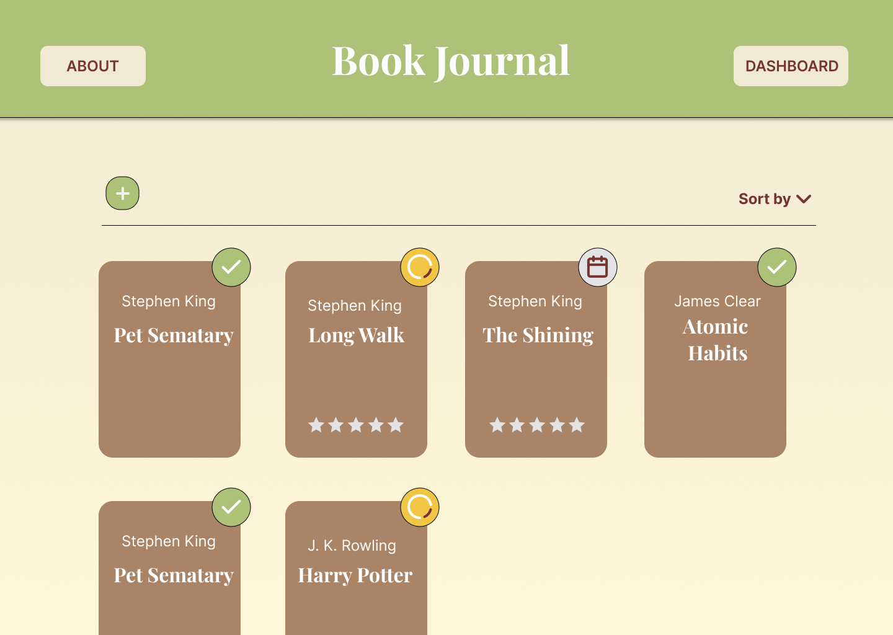

# Book Journal

A full-stack web application for tracking books, reading progress, and personal notes.

## UI Preview

## Tech Stack

- **Frontend**: React
- **Backend**: Java 
- **Database**: H2 (to be replaced with PostgreSQL)

## Technologies Used

- Spring Boot
- Spring Data JPA
- Maven
- Lombok
- React
- Vite
- TypeScript
- Axios
- Java 21

## Features

- Add, update, delete and view books
- Assign a reading status: To Read, Reading, Finished, Dropped
- Add personal rating and review
- Track reading progress over time
- Add and manage quotes for each book
- Assign a color to each book for visual grouping
- Filter and sort by:
  - Author
  - Title
  - Rating
  - Reading status
  - Time period (monthly/yearly statistics)

## Pages

- **Home** – list of all books with filters and sorting
- **Statistics** – charts of reading progress (by year, month, etc.)
- **Add/Edit Book** – form to manage books
- **Book Details** – detailed view with quotes and personal notes
