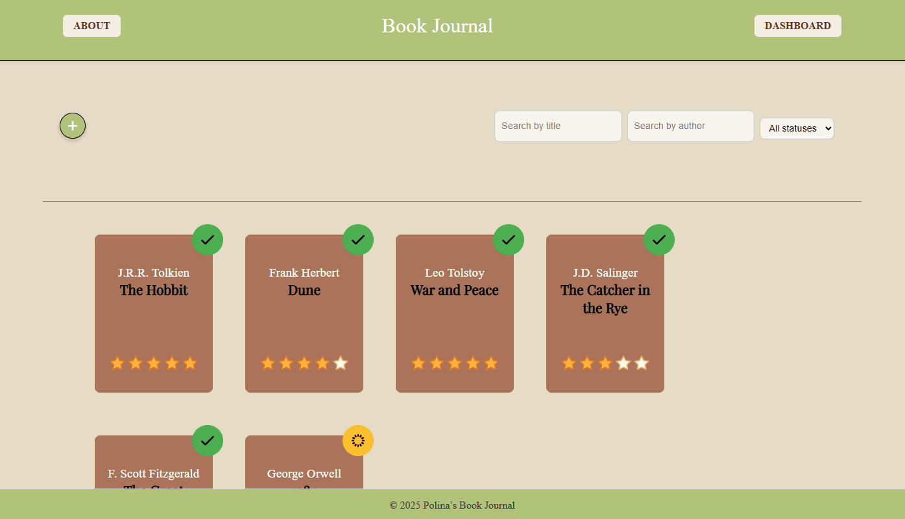

# Book Journal

A modern full-stack web application for tracking your reading journey, managing your personal library, and organizing books by status, rating, and custom colors.

## UI Preview



## Architecture

Book Journal follows a client-server architecture with a RESTful API backend and a responsive React frontend.

### Backend Architecture

- **Framework**: Spring Boot 3.5.4 with Spring Web and Spring Data JPA
- **Database**: H2 Database (file-based for persistence)
- **Build Tool**: Maven
- **Language**: Java 21
- **ORM**: Hibernate (via Spring Data JPA)
- **API**: RESTful endpoints with JSON communication
- **Cross-Origin**: CORS enabled for frontend communication

### Frontend Architecture

- **Framework**: React 19 with Hooks
- **Build Tool**: Vite
- **Routing**: React Router DOM v7
- **HTTP Client**: Axios for API communication
- **Styling**: CSS Modules with custom properties
- **State Management**: React useState/useEffect hooks
- **Icons**: Custom PNG assets for status indicators
- **Fonts**: Google Fonts (Playfair Display, Cormorant Garamond)

### Key Technologies & Libraries

#### Backend

- **Spring Boot Starter Web**: REST API development
- **Spring Boot Starter Data JPA**: Database operations and ORM
- **H2 Database**: Embedded SQL database for development/production
- **Lombok**: Code generation for getters/setters/constructors
- **Maven Wrapper**: Build automation and dependency management

#### Frontend

- **React**: Component-based UI framework
- **React DOM**: DOM rendering
- **React Router DOM**: Client-side routing
- **Axios**: HTTP client for API calls
- **Vite**: Fast build tool and development server
- **ESLint**: Code linting and quality assurance
- **@smastrom/react-rating**: Star rating component
- **@fontsource/***: Self-hosted Google Fonts
- **CSS Modules**: Scoped styling with custom properties

### Data Flow

1. **Frontend** makes HTTP requests to REST API endpoints
2. **Backend** processes requests through Spring MVC controllers
3. **Spring Data JPA** handles database operations via repositories
4. **H2 Database** persists book data in local file system
5. **Frontend** receives JSON responses and updates UI state
6. **LocalStorage** provides client-side data persistence fallback

## Features

- Add, update, delete and view books
- Assign a reading status: To Read, Reading, Finished, Dropped
- Add personal rating and review (only for Finished/Dropped books)
- Track reading progress over time
- Assign a color to each book for visual grouping
- Filter and sort by:
  - Author
  - Title
  - Rating
  - Reading status
  - Time period (monthly/yearly statistics)

## Getting Started

### Prerequisites

- **Java 21** or higher
- **Node.js 18+** and npm
- **Git** for cloning the repository

### Installation & Setup

1. **Clone the repository**

   ```bash
   git clone <repository-url>
   cd book-journal
   ```

2. **Start the Backend**

   ```bash
   cd backend
   # On Windows:
   .\mvnw.cmd spring-boot:run
   # On macOS/Linux:
   ./mvnw spring-boot:run
   ```

   The backend will start on `http://localhost:8080`

3. **Start the Frontend** (in a new terminal)

   ```bash
   cd frontend
   npm install
   npm run dev
   ```

   The frontend will start on `http://localhost:5173`

4. **Access the Application**

   Open your browser and navigate to `http://localhost:5173`

### Database

- The application uses H2 database with file-based persistence
- Database files are automatically created in `backend/data/bookjournal.mv.db`
- H2 Console is available at `http://localhost:8080/h2-console` (JDBC URL: `jdbc:h2:file:./data/bookjournal`)

### Development

- **Frontend**: `npm run dev` for hot-reload development
- **Backend**: Spring Boot DevTools provides automatic restart
- **Linting**: `npm run lint` for code quality checks

## Pages

- **Home** – list of all books with filters and sorting
- **About** – application information and features
- **Add/Edit Book** – form to manage books

## API Endpoints

- `GET /api/books` – Fetch all books (with optional filters)
- `POST /api/books` – Create a new book
- `PATCH /api/books/{id}` – Update an existing book
- `DELETE /api/books/{id}` – Delete a book
- `GET /api/books/stats/monthly` – Get monthly reading statistics

## Contributing

1. Fork the repository
2. Create a feature branch
3. Make your changes
4. Test thoroughly
5. Submit a pull request

## License

© 2026 Polina Katkova. Built with React and Spring Boot.
